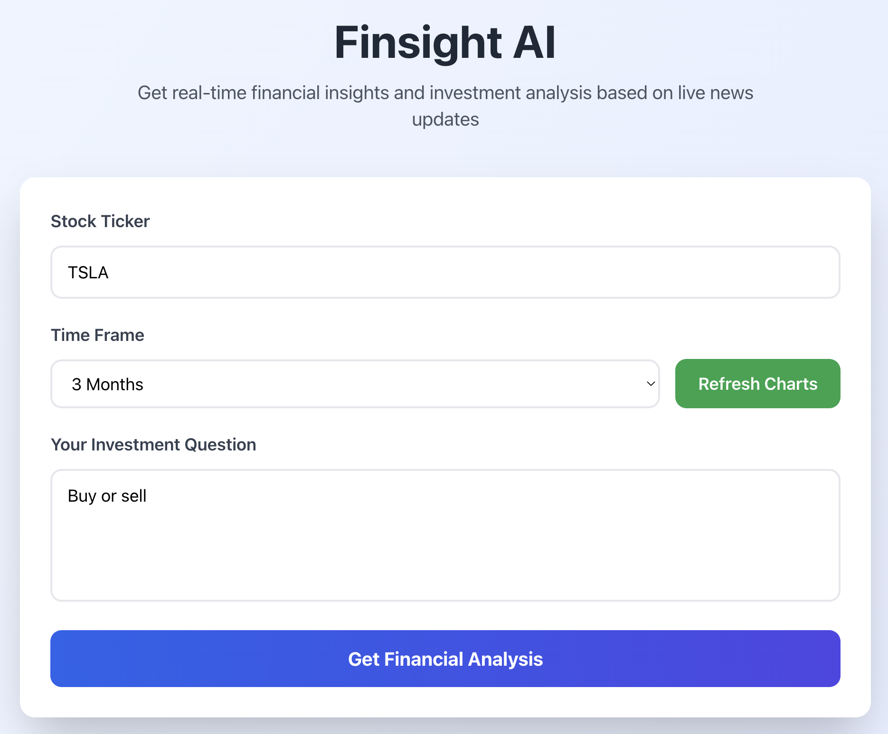

# Finsight AI



A web application that provides financial analysis inference using a finetuned LM using Retrieval-Augmented Generation (RAG) combined with real-time news data. Think of it as having a financial analyst that can quickly read through the latest news about any company and give you investment insights.

## What This Does

This app lets you ask questions about any publicly traded company, and it will:
- Fetch the most recent news articles about that company
- Analyze which news is relevant to your specific question
- Generate a comprehensive investment analysis based on that information
- Provide recommendations with supporting evidence

## Features

- Real-time financial news: Automatically fetches the latest news from NewsAPI for any ticker you search
- Intelligent analysis: Uses embeddings and vector search to find news most relevant to your question
- Investment recommendations: Provides Buy/Hold/Sell recommendations with detailed rationale
- Modern interface: Clean, responsive web interface built with React
- Graph Based Responses: Provides graphical analysis of current stock and allows for visual information
- Progress tracking: See exactly what the system is doing as it processes your request(future implementation: Chain of Thought Reasoning)

## Architecture

The application has two main parts:

1. **Backend API** (in the `/api/` folder): A FastAPI server that runs the AI model locally, handles news retrieval, creates embeddings, and performs vector search using FAISS vector database
2. **Frontend** (in the `/frontend/` folder): A React web application that provides the user interface and sends POST requests

The backend processes everything locally, which means your data stays on your machine and you don't need to worry about API costs for the finetuned AI model since it is loaded onto your computer. The only API keys needed are yfinance and NewsAPI

## What You'll Need

For replication of this project you need:

- Python 3.9 or higher
- Node.js 16 or higher
- At least 8GB of RAM (16GB recommended for better performance, I found that it saves a lot of time especially in testing and validation)
- A NewsAPI key (free tier gives you 100 requests per day, which is plenty for testing)
- The model file: `Qwen-2.5-7B-Instruct` (about 4.4GB which you can find here: [Hugging Face Qwen Model](https://huggingface.co/Qwen/Qwen2.5-7B-Instruct))

Or you can use this code:

```
BASE_MODEL = "Qwen/Qwen2.5-7B-Instruct"
tokenizer = AutoTokenizer.from_pretrained(BASE_MODEL, use_fast=True)

model = AutoModelForCausalLM.from_pretrained(

    BASE_MODEL,
    quantization_config=bnb_config,

    device_map="auto",
    attn_implementation="eager",
)

```

## Quantinization

This model is first quantinized utilzing **QLoRA 4-Bit training**. Since I was training with limited time and resources I quantinized the model to 4-bit integers instead of the normal 16 or 32. I trained the model using 4-bit weights, but I also utilized **double quantinization** to reduce the file size by around 1.1 GB. This technique quantinizes the scale factor(quantinized_weight * scale ~ original_weight) as well. The scale factor is needed to dequantinize the weights after LoRA training so it is a 16 or 32 bit integer itself. By converting this a 8-bit integer the overall training time heavily decreases, but the computational cost to dequantize is a little higher.

By using:

```
bnb_4bit_use_double_quant=True
```
You can double quantize your model for more effcient training. After training I then merged the LoRA weights with the original model again to "finetune" the model. This step converted it back to a FP16 model. Using the **llama.cpp** package I quantized the GGUF FP16 file to a 4-bit, K-quantized, medium-variant GGUF file for CPU level support and on-device inference(q4_k_m.gguf).

### Using Your Finetuned LoRA Zip

If you trained a LoRA adapter (for example `qwen2.5-7b-finance-lora.zip`), you cannot load that zip directly with `llama-cpp-python`.

This app requires a `.gguf` model file, so use this flow:
1. Merge LoRA adapter with base HF model on Colab
2. Convert merged model to GGUF utilzing the llama cpp package
3. Run app with `MODEL_PATH=./your-finetuned-model.gguf`

This is all done in the [LoRA Finetuning File](https://github.com/vihaankrishna100/FinSight-AI/blob/main/lora_finetuned_financial_mode%20(1).py)


## Getting Started

### Setting Up the Backend

First, let's get the backend running:

```bash
# Go into the api directory
cd api

# Create a virtual environment (this keeps dependencies organized)
python -m venv venv

# Activate it (on Mac/Linux)
source venv/bin/activate
# On Windows, use: venv\Scripts\activate

# Install all the required packages
pip install -r requirements.txt

# Make sure you have the model file in the api directory
# It should be named: qwen2.5-7b-Q4_K_M.gguf
```

heres the code to start the backend:

```bash
python main.py
```

You should see the model loading (this takes 3-4 minutes), and then it will say the server is running on `http://localhost:8000`. This is not where the site is hosted rather where the backend appears. A confirmation will appear in your terminal and on the site telling you that the backend finished running. 

### Setting Up the Frontend

keep the backend running, but create a new terminal window for the frontend:

```bash
# Go into the frontend directory
cd frontend

# Install all the JavaScript dependencies
npm install

# Start the development server
npm start
```

The frontend will open automatically in your browser at `http://localhost:3000`. If it doesn't, just type it manually


### NewsAPI Key

The NewsAPI key is currently hardcoded in the `api/main.py` file. For production use, you should move it to an environment variable. You can get a free API key from [newsapi.org](https://newsapi.org).

To use an environment variable:

1. Create a `.env` file in the `api/` directory
2. Add: `NEWS_API_KEY=your_key_here`
3. Update the code to read from environment variables (using `python-dotenv`)


## How the RAG System Works

This application utilized a RAG-based retrieval system for increased reliable outputs by the LLM. This system utilizes the NewsAPI and yfinance API to get information about a specific stock the user inputs. This is a naive single-stage RAG with hybrid context(unstructures and structured data). The frontend sends a POST request to the FAST API, and the backend starts to get the data. It sends API requests to the NewsAPI and yfinance. This information is converted into embeddings by a MiniLM-L6-v2 and stored in a FAISS vector database.  

```
query_emb = embedder.encode([query])
    distances, indices = news_index.search(np.array(query_emb), top_k)

    relevant = [news_texts[idx] for idx in indices[0] if idx < len(news_texts)]
    return "\n".join(relevant)
```

The question is also converted into an embedding here:

```
query_emb = embedder.encode([query])
distances, indices = news_index.search(np.array(query_emb), top_k)
```
Then the backend computes the squared Euclidean (L2) distance between the query vector and stored news vectors. It then returns the top k vectors with the smallest distances away. This means that they are more semantically similar. This will cut the 15 articles initially to the 5 most semantically-similar articles. These embeddings are pointing to the relative text which is then retrieved and inputted into the LLM prompt.

# Issues Fixed

**Stock Ticker -> Company Search**: Before the backend was not able to convert the company name to the ticker symbol. This is needed for the newly added yfinance API to get stock data and espcially data for the graph. We changed the user input to give ticker instead of name.

**RAG Retrieval Relevancy**: When model inference ran the model was not recieving relevant news sources from the API call. The backend was just recieving and embedding the **newest** 5 articles. This also made the corpus extremely small. I fixed the API search to get the first 15 news articles, and implemented keyword search + relevancy search rather than publish date. Financial data was also important:

Using filtering within the API:

```
financial_domains = "bloomberg.com,reuters.com,cnbc.com,wsj.com,marketwatch.com,finance.yahoo.com,fool.com,seekingalpha.com,barrons.com,investopedia.com"
    
    # Enhanced query with financial context for better overall analysis and less room for hallucinations with limited tokens

    enhanced_query = f'"{company_name}" AND (stock OR earnings OR market OR investment OR shares OR revenue OR profit)'
    
    url = (f"https://newsapi.org/v2/everything?"
           f"q={enhanced_query}&sortBy=relevancy&pageSize=15&apiKey={NEWS_API_KEY}&language=en"
           f"&domains={financial_domains}")
    response = requests.get(url)
```

I filtered to utilize real, credible financial sources. Also, the initial query from the user is usually short and low on context. I prompt the LLM with an enahnced context instead to look at the whole market perspective to answer the user's questions. 

## License

This project is open source and available under the MIT License.


